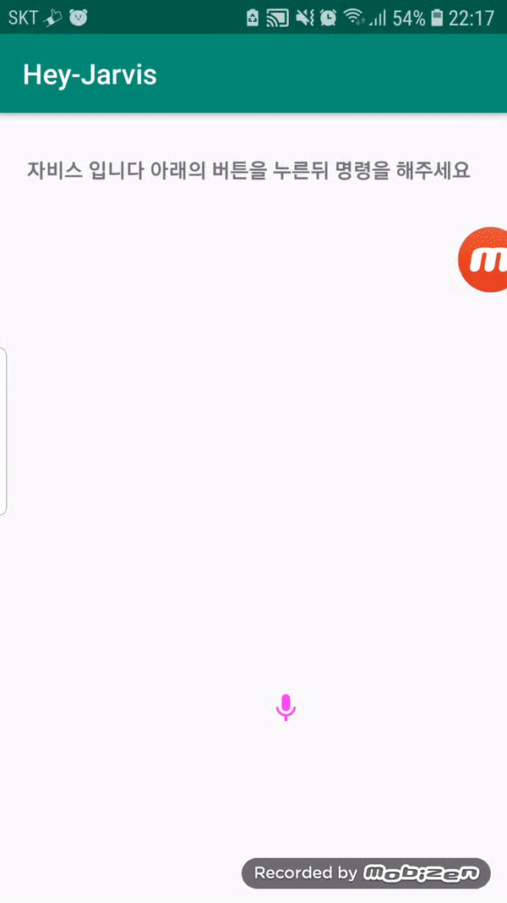
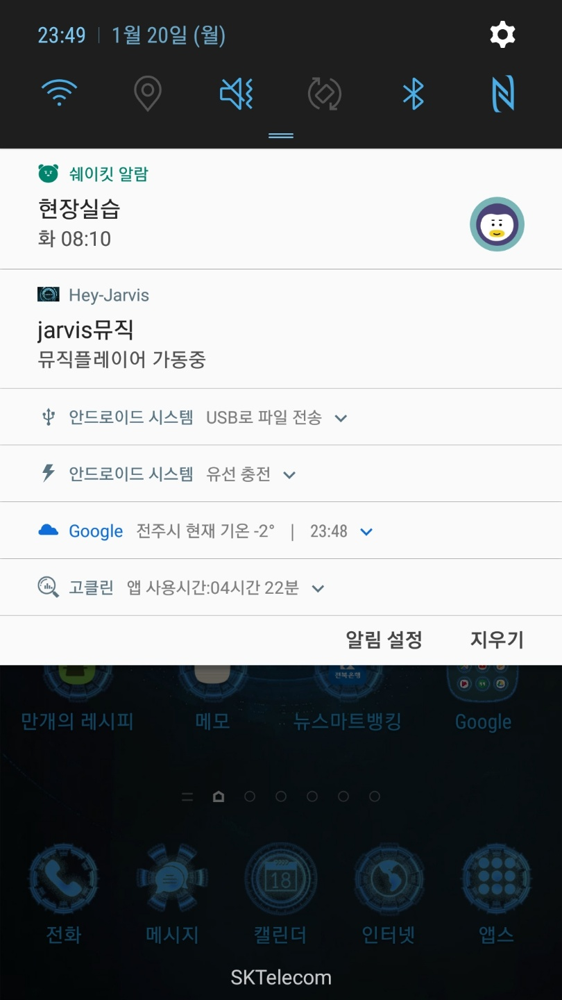

first try

### content:

- This way, the script was recorded on Google and changed its direction.

change feature

### content:

- change Stt input and create reply

search feature 

### content:

- search feature and backpresshandler 

loading screen  

### content:

- jarvis loading scren

music feature create  

### content:

- jarvis music player 

## 👀 Todo List
* JSOUP parsing 
* https://developer.android.com/reference#ACTION_RESERVE_TAXI_RESERVATION
* notification click event 
