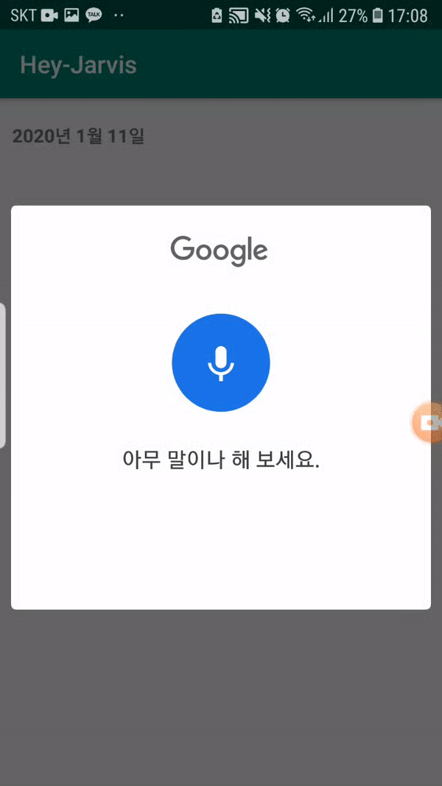
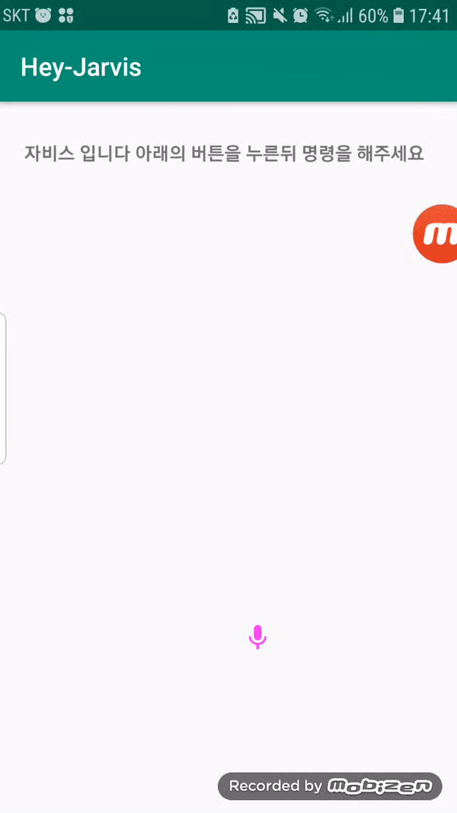

# Hey-Jarvis
 An Android application that performs commands with voice recognition
 - https://developer.android.com/guide/components/intents-common.html#java
 
- first try

>This way, the script was recorded on Google and changed its direction.

- I changed it the following way.

- 택시 불러 줘 라고말할시 
   callCar() 호출  (This function is only available on wear os..?)
<code>
      public void callCar() {
 
         Intent intent = new Intent(ReserveIntents.ACTION_RESERVE_TAXI_RESERVATION);
          
          if (intent.resolveActivity(getPackageManager()) != null) {
           
           startActivity(intent);
        
        }
     
     }

</code>

